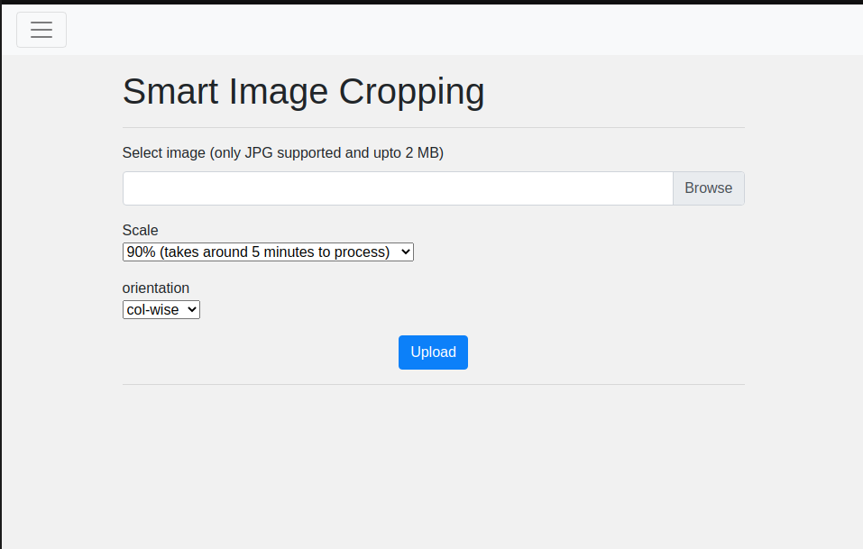
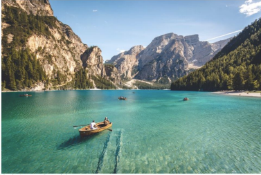
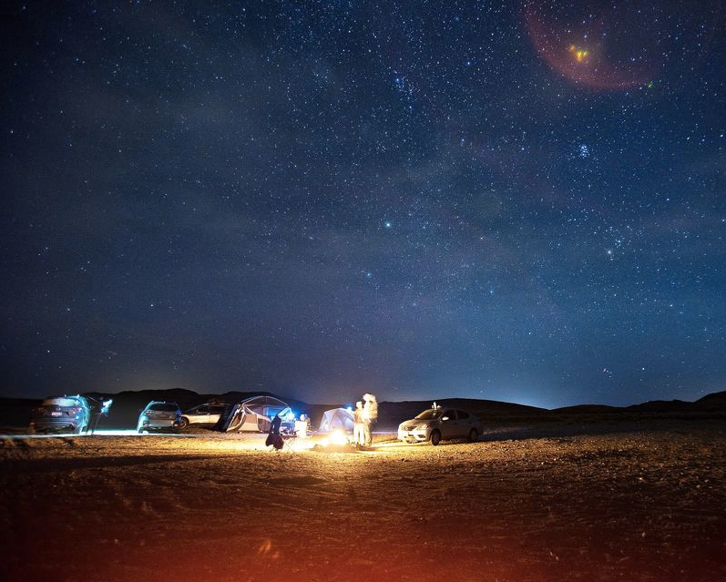
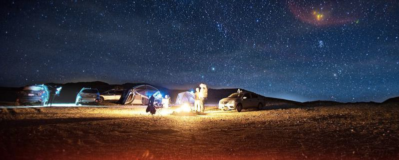

## Smart Image Cropping

This Application is developed to make the work of Image Resizing more precise by
using the energy function under the domain of Seam Carving Algorithm through
Content Aware Image Resizing. **There will be no loss of objects or active pixels
in the resized image hence the resizing will be lossless in terms of content of the
image**.
The major aim of this application aims to make image resizing to be looked upon
with a new vision. We can apply this image resizing in various places where the
images are needed to be resized. We can give an option to the user to choose
from a range of image resizing options where they can select from cropping and
seam carving
We will provide two options to the user. One will be how much of the original
image needs to be cropped, and the other will be how to image is to be cropped row wise or column wise.


## Installation

```bash
git clone https://github.com/roshansourav/impproject.git
cd Smart-Image-Cropping/
python3 -m venv env
source env/bin/activate
pip install -r requirements.txt 
flask run
```

## The Output  
 


## Results

#### Test 1
###### Before  
 

###### After  


#### Test 2
###### Before  
 

###### After  


## Deployed   
###### [WARNING: App is running very slow, any suggestions will be appreciated, you can open an issue and we will discuss]   
https://impproject.herokuapp.com/ 


## Contributing
Pull requests are welcome. For major changes, please open an issue first to discuss what you would like to change.
